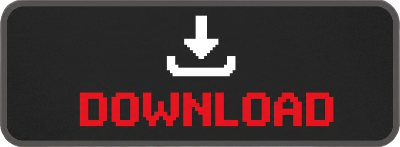
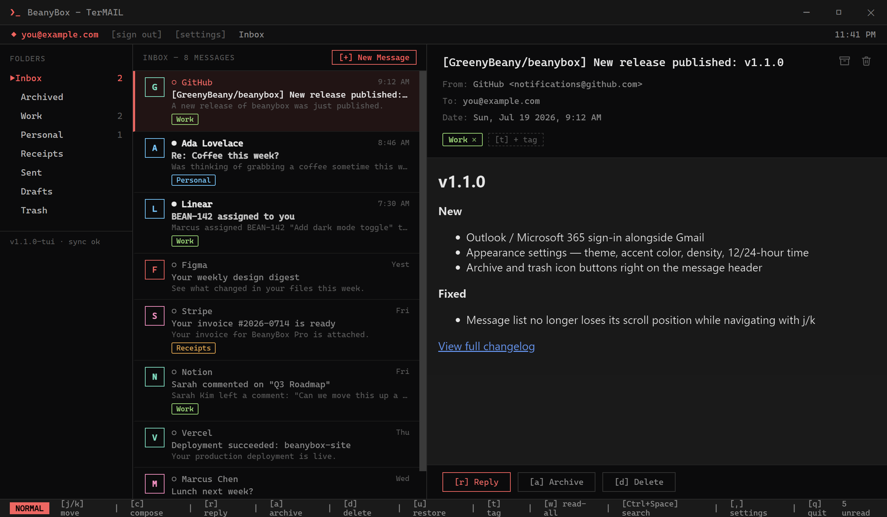
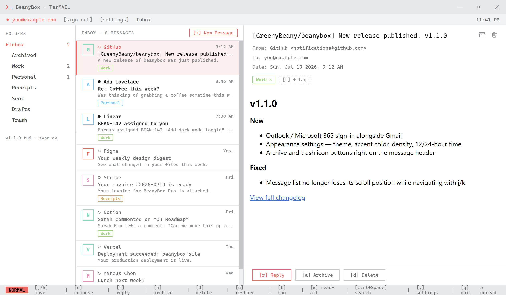
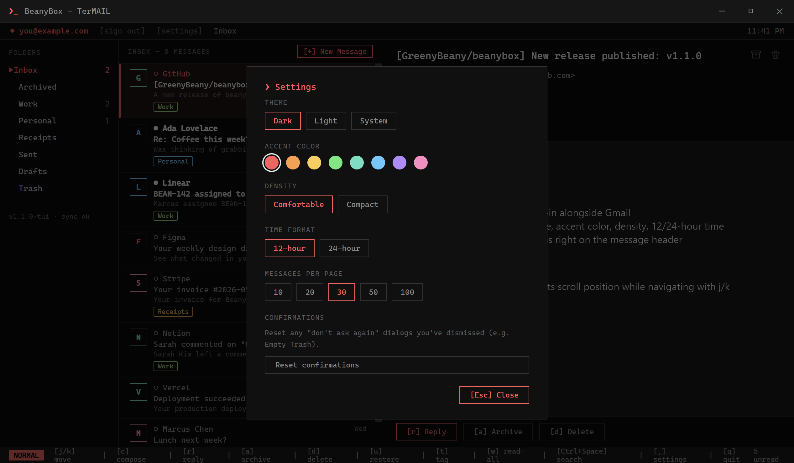
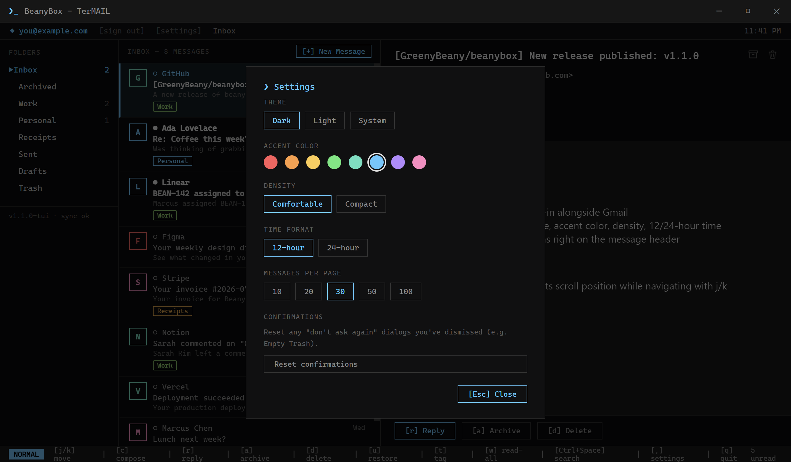
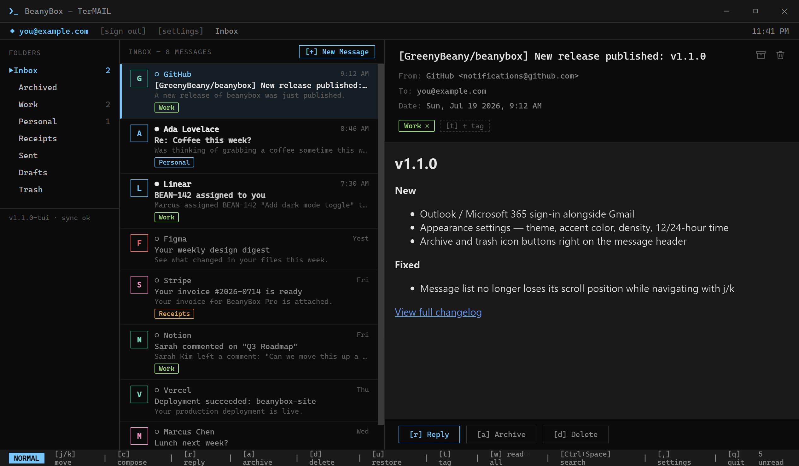

<p align="center">
  
</p>

<h1 align="center">BeanyBox</h1>

<p align="center">
  A terminal-styled desktop email client for Gmail — keyboard-driven, themeable, built with Electron.
</p>

<p align="center">
  <a href="#showcase">Showcase</a> ·
  <a href="#features">Features</a> ·
  <a href="#getting-started">Installation</a> ·
  <a href="#keyboard-shortcuts">Shortcuts</a> ·
  <a href="#notes">Notes</a>
</p>

<p align="center">
  <a href="https://github.com/greenythebeany/BeanyBox/releases">
    
  </a>
</p>

---

BeanyBox talks to your real Gmail account over OAuth — Google's own sign-in
page handles your password, BeanyBox never sees it. Everything (read, send,
reply, archive, trash, tag, search) runs against the live Gmail API, wrapped
in a fast, keyboard-first TUI-inspired interface instead of a browser tab.

## Showcase

<p align="center">
  
</p>

<p align="center"><i>
  Gmail labels show up as colored tags, HTML email renders for real, and
  archive/trash sit right on the message header.
</i></p>

### Light & dark

Pick a theme in Settings (`,`) — Dark, Light, or System (follows your OS and
switches live if it changes):

<table>
<tr>
<td width="50%"></td>
<td width="50%"></td>
</tr>
<tr>
<td align="center">Light</td>
<td align="center">Dark</td>
</tr>
</table>

### Every color

Eight accent colors, applied live everywhere — active rows, borders, buttons,
the mode badge — plus density (comfortable/compact) and a 12-hour/24-hour
time switch:

<table>
<tr>
<td width="50%"></td>
<td width="50%"></td>
</tr>
</table>

<p align="center">
  
</p>

## Features

- **Keyboard-driven** — `j`/`k` to move, `c` compose, `r` reply, `a` archive,
  `d` delete, `t` tag, `w` mark all read, `Ctrl+Space` search, `,` settings,
  `q` quit
- **Appearance settings** — dark/light/system theme, 8 accent colors,
  comfortable/compact density, 12-hour/24-hour time, all live-applied with
  no restart
- **Real HTML rendering** for styled email (sandboxed, no scripts, no page
  navigation — links always open in your default browser)
- **Archive/trash icons** right on the message header, alongside the usual
  keyboard shortcuts and buttons
- **Attachments** — attach files to outgoing mail, save incoming ones via a
  native dialog
- **Search, pagination, and bulk actions** (mark all read, empty trash)
- **Restore** — undo an accidental archive or trash in one keypress
- **AI draft assist** — bring your own OpenAI or Anthropic API key (Settings
  → AI draft assist) and a **[ AI ]** button shows up next to Subject once
  you've typed one; click it to draft a message from the subject, or a
  reply using the original message as context
- Encrypted token storage via Electron's `safeStorage` — Windows DPAPI,
  macOS Keychain, or the Linux Secret Service (gnome-keyring/kwallet) if
  one's running; falls back to plain storage otherwise, same as any other
  Electron app

## Getting started

### Google Cloud setup (one-time, ~5 minutes)

Google requires every app that talks to Gmail to have its own OAuth client.
You create this yourself, in your own Google account — BeanyBox doesn't ship
with one built in, so nobody's credentials are bundled in the app or this repo.

1. Go to [console.cloud.google.com](https://console.cloud.google.com/) and
   create a new project (any name, e.g. `beanybox-mail`).
2. **APIs & Services → Library** → search **Gmail API** → **Enable**.
3. **APIs & Services → OAuth consent screen**
   - User type: **External**
   - App name: `BeanyBox`, plus your email as support/contact
   - Scopes → **Add or Remove Scopes** → search **Gmail API** → check the
     one described as *"Read, compose, send, and permanently delete all
     your email from Gmail"* (`https://mail.google.com/`). This is a
     restricted scope, so it must be added explicitly even in Testing mode.
   - Test users → add your own Gmail address
4. **APIs & Services → Credentials → Create Credentials → OAuth client ID**
   - Application type: **Desktop app**
   - Copy the **Client ID** and **Client secret**
5. Paste those two values into BeanyBox: on first launch, the login screen
   asks for them directly; later on you can change them any time in
   **Settings → Google OAuth client**. They're stored encrypted on your
   machine only (same mechanism as your mail tokens) — never in this repo,
   never bundled into a built `.exe`/`.AppImage`.

### Install

**Option A: Download (recommended)** — grab the latest portable `.exe` or
NSIS installer (Windows) or `.AppImage` (Linux) from the
[Releases page](https://github.com/greenythebeany/BeanyBox/releases). No
Node/npm needed; nothing is bundled inside it except the app itself — you
still bring your own Google OAuth client from the step above, entered on
first launch.

**Option B: Run from source**

```sh
npm install
npm start
```

Either way: paste your Client ID/Secret on the first-run screen, then click
**Sign in with Google** (`Enter` to go) — your default browser opens
Google's real consent page. Approve it and you're in. A refresh token is
stored encrypted in your user profile, so you won't need to sign in again.

### Build a standalone app yourself (optional)

Only needed if you want to build your own `.exe`/`.AppImage` instead of
using the one from Releases:

```sh
npm run dist
```

On Windows this produces a portable `.exe` and an NSIS installer in `dist/`.
On Linux it produces an `.AppImage` — make it executable (`chmod +x
BeanyBox-*.AppImage`) and run it directly, no installation needed. Either
way, it runs BeanyBox without a terminal, pinnable to your taskbar/dock like
any other app.

> **Windows: if the build fails with a symlink/`Cannot create symbolic link`
> error**, or `dist/win-unpacked` contains a generic `electron.exe` with no
> icon: Windows blocks regular accounts from creating symlinks, which the
> packaging step needs briefly. Turn on **Developer Mode** (Settings →
> Privacy & Security → For Developers) once, or run the command from an
> elevated ("Run as administrator") terminal.

### AI draft assist setup (optional)

This is a separate, paid, pay-per-use API — **not** the same thing as a
ChatGPT Plus or Claude Pro subscription, and those subscriptions don't
unlock it. You're billed by usage (typically fractions of a cent per
email draft), so add a small amount of credit rather than a subscription.

**OpenAI:**
1. Go to [platform.openai.com/api-keys](https://platform.openai.com/api-keys)
   (sign in or create an account).
2. Add billing: **Settings → Billing** → add a payment method and a small
   amount of credit (a few dollars covers a very large number of drafts at
   the model below).
3. Back on the API keys page, **Create new secret key**, copy it — you
   won't be able to see it again after this.

**Anthropic (Claude):**
1. Go to [console.anthropic.com/settings/keys](https://console.anthropic.com/settings/keys)
   (sign in or create an account).
2. Add billing: **Settings → Billing** → add a payment method and a small
   amount of credit.
3. **Create Key**, copy it.

Paste whichever key into **Settings → AI draft assist** in the app.

**Which model to pick** (for low cost + still-good results): leave the
model field blank to use BeanyBox's built-in defaults — `gpt-4o-mini` for
OpenAI, `claude-3-5-haiku-20241022` for Anthropic. Both are each
provider's small/fast tier: a fraction of the cost of their flagship models
(GPT-4o / Claude Opus) while still writing perfectly coherent, well-formed
email drafts — overkill quality isn't really the point for a one-paragraph
reply. Only override the model field if you specifically want to spend
more for a smarter model, or a provider retires one of these two names —
check the provider's own pricing page for their current cheapest small
model if so, since exact model names and prices shift over time.

## Keyboard shortcuts

| Key            | Action                             |
| -------------- | ----------------------------------- |
| `j` / `k`      | Move selection down / up            |
| `c`            | Compose new message                 |
| `r`            | Reply                               |
| `a`            | Archive                             |
| `d`            | Delete (move to Trash)              |
| `u`            | Restore (from Trash or Archived)    |
| `t`            | Tag / apply label                   |
| `w`            | Mark all as read in this folder     |
| `Ctrl`+`Space` | Search                              |
| `,`            | Settings (theme, accent, density…)  |
| `q`            | Quit                                |
| `Esc`          | Discard compose / close panel       |

## Notes

- **Scope**: uses the full `https://mail.google.com/` scope (read, send,
  archive, trash, permanent delete) — Gmail requires this broadest scope
  specifically for permanent delete. Access is limited to mail only, nothing
  else in your Google account.
- **Folders**: Inbox, your custom labels, Starred, Sent, Drafts, Trash, and
  a synthetic **Archived** view (Gmail has no real "archived" label —
  archiving just removes Inbox, so this is a saved search under the hood).
- **Tags**: Gmail labels show up as colored chips — add, remove, or create
  them on the fly.
- **Trash**: the header button becomes **Empty Trash**, confirmed via an
  in-app dialog (with an optional "don't ask again"). Individual messages no
  longer have their own permanent-delete action — that's what Empty Trash
  and `u` (Restore) are for.
- **Images**: load automatically, including remote ones from
  newsletters/marketing mail. Note that's a deliberate privacy tradeoff —
  remote images are a classic way for senders to detect that you opened
  their email.
- **Sign out**: click **[sign out]** next to your email address (top bar).
  To force a fresh sign-in after a scope change, that alone isn't enough —
  delete the `tokens.enc` file and restart, under `%APPDATA%/BeanyBox/` on
  Windows or `~/.config/BeanyBox/` on Linux.
- **Google OAuth client**: your Client ID/Secret are stored encrypted the
  same way as your mail tokens, under `google-oauth-config.enc` in that same
  folder. Changing them in Settings signs you out, since the stored session
  belongs to whichever client it was issued to.
- **AI draft assist**: the API key is stored encrypted the same way as your
  mail tokens and lives only in the main process — the renderer never sees
  it, only whether one's saved. It's sent to whichever provider (OpenAI or
  Anthropic) you configure, and nowhere else. The subject line (plus the
  original message's body, when replying) is sent as the prompt.
